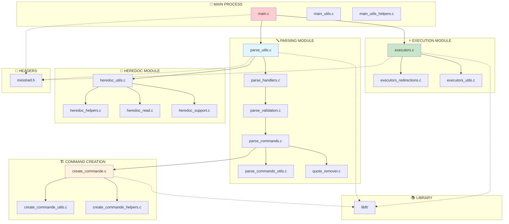
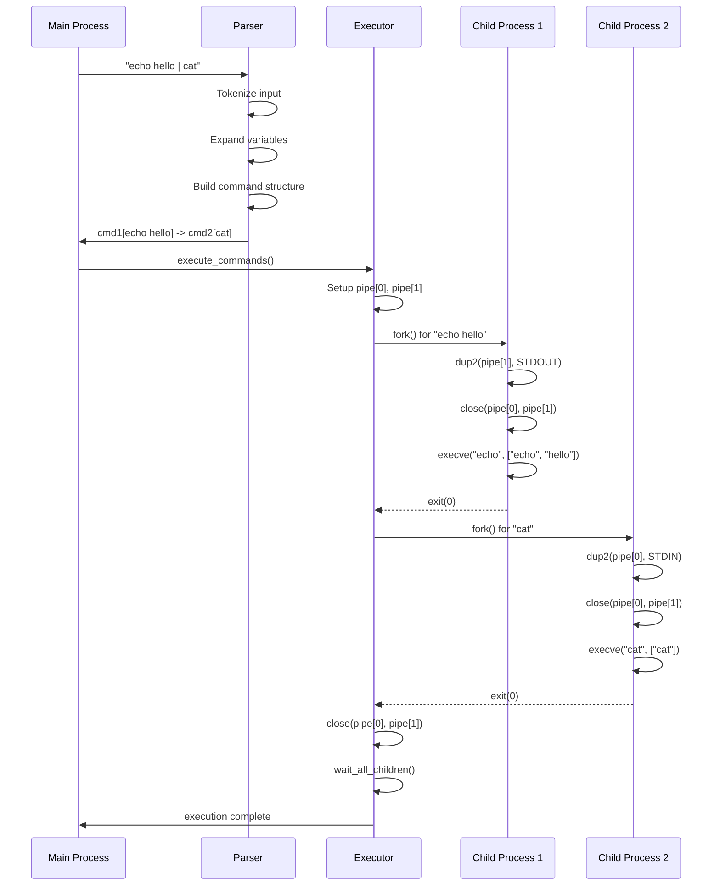
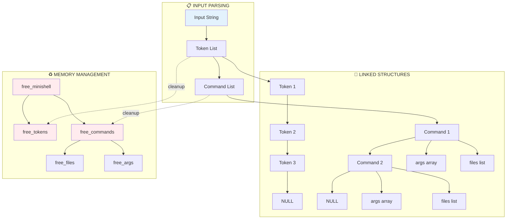
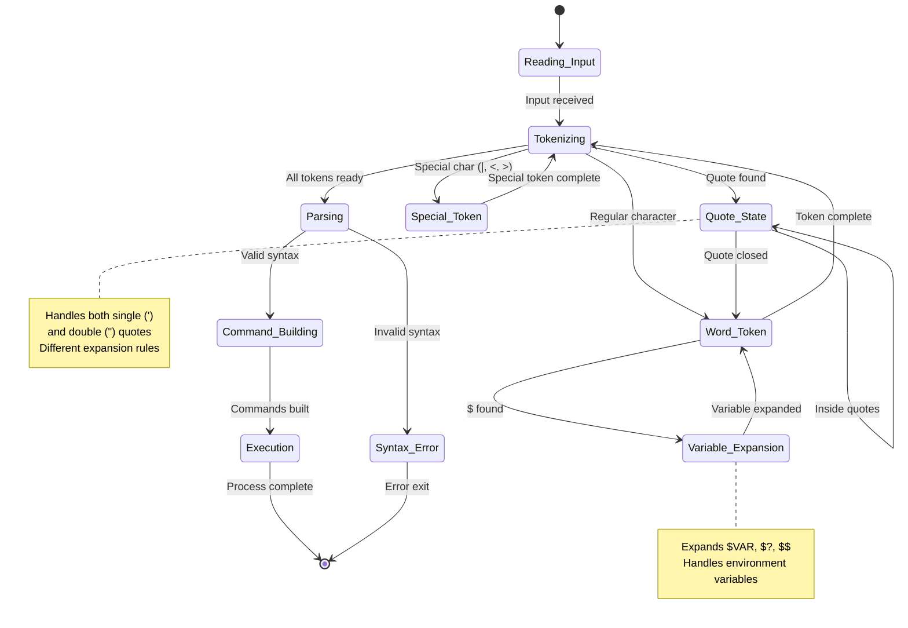
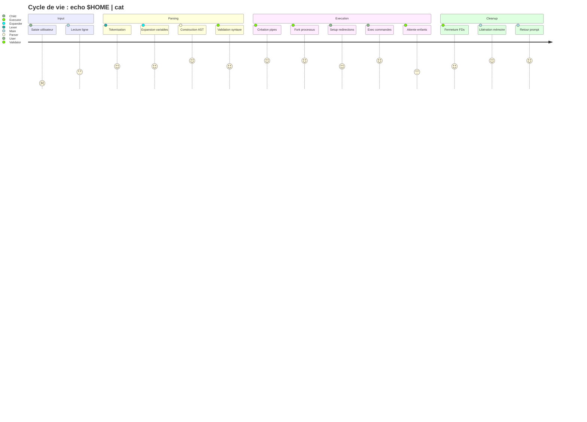
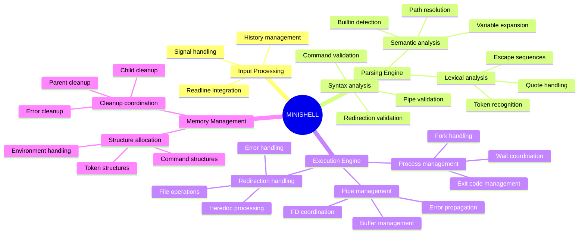
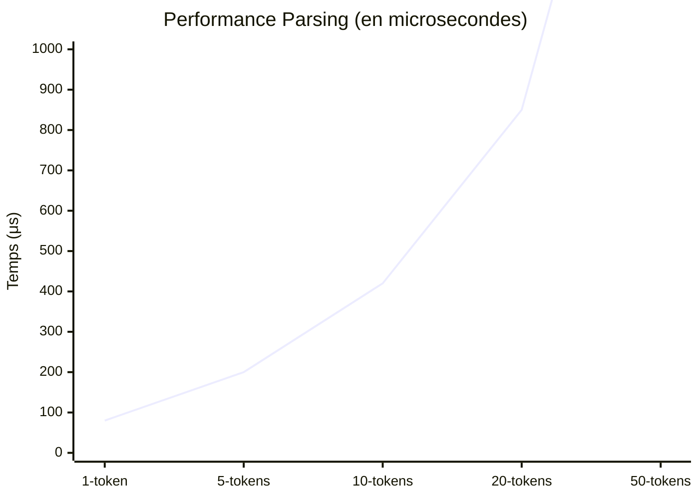
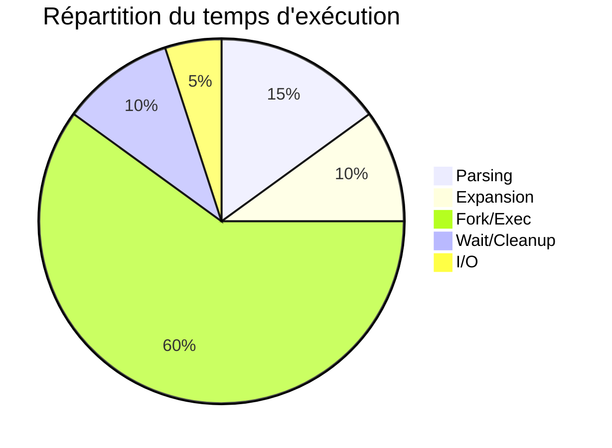

# 📊 Diagrammes Architecture - Minishell

## 🎯 Vue d'ensemble du flux principal

```mermaid
flowchart TD
    A[Input: echo $HOME pipe cat] --> B[Lexer/Tokenizer]
    B --> C[Token Stream]
    C --> D[Expander]
    D --> E[Expanded Tokens]
    E --> F[Parser]
    F --> G[Command Structure]
    G --> H[Executor]
    H --> I[Output]
    
    B --> B1[WORD: echo]
    B --> B2[VAR: $HOME]
    B --> B3[PIPE: |]
    B --> B4[WORD: cat]
    
    D --> D1[WORD: echo]
    D --> D2[WORD: /Users/user]
    D --> D3[PIPE: |]
    D --> D4[WORD: cat]
    
    F --> F1[CMD1: args[echo, /Users/user]]
    F --> F2[CMD2: args[cat]]
    
    H --> H1[fork + pipe + exec]
    H --> H2[Process Management]
    
    style A fill:#e1f5fe
    style I fill:#c8e6c9
    style H fill:#fff3e0
```

## 🏗️ Architecture modulaire détaillée



## 🔄 Pipeline d'exécution des commandes



## 🧠 Gestion mémoire et structures de données



## 🔧 Processus de parsing détaillé



## 🚀 Architecture des processus et pipes

```mermaid
graph LR
    subgraph "🔄 MAIN PROCESS"
        M[Main Shell]
        P[Parser]
        E[Executor]
    end
    
    subgraph "⚡ CHILD PROCESSES"
        C1[Child 1: echo hello]
        C2[Child 2: cat]
        C3[Child 3: grep test]
    end
    
    subgraph "🔗 PIPES"
        P1[pipe1[0,1]]
        P2[pipe2[0,1]]
    end
    
    M --> P
    P --> E
    
    E --> C1
    E --> C2
    E --> C3
    
    C1 -->|stdout| P1
    P1 -->|stdin| C2
    
    C2 -->|stdout| P2
    P2 -->|stdin| C3
    
    E -.->|wait()| C1
    E -.->|wait()| C2
    E -.->|wait()| C3
    
    style M fill:#e1f5fe
    style C1 fill:#c8e6c9
    style C2 fill:#c8e6c9
    style C3 fill:#c8e6c9
    style P1 fill:#fff3e0
    style P2 fill:#fff3e0
```

## 📊 Cycle de vie d'une commande



## 🎯 Diagramme des responsabilités



## 🔍 Diagramme de classes (structures C)

```mermaid
classDiagram
    class t_minishell {
        +t_env *env
        +t_cmd *commands
        +char **envp
        +int exit_code
        +int in_heredoc
    }
    
    class t_cmd {
        +char **args
        +char *path
        +t_file *files
        +t_cmd *next
        +int builtin_type
    }
    
    class t_token {
        +char *value
        +t_token_type type
        +t_token *next
        +int quoted
    }
    
    class t_file {
        +char *filename
        +t_file_type type
        +t_file *next
        +int fd
    }
    
    class t_env {
        +char *key
        +char *value
        +t_env *next
        +int exported
    }
    
    class t_process_data {
        +t_minishell *shell
        +t_shell_ctx *ctx
        +char *input
        +int flags
    }
    
    t_minishell ||--o{ t_cmd : contains
    t_minishell ||--o{ t_env : manages
    t_cmd ||--o{ t_file : has
    t_token ||--o| t_token : next
    t_cmd ||--o| t_cmd : next
    t_file ||--o| t_file : next
    t_env ||--o| t_env : next
    
    t_process_data ||--|| t_minishell : uses
```

## 📈 Métriques et performance





Ces diagrammes Mermaid peuvent être intégrés directement dans la documentation GitHub ou visualisés sur des plateformes supportant Mermaid comme GitLab, Notion, ou des éditeurs comme VS Code avec l'extension Mermaid.