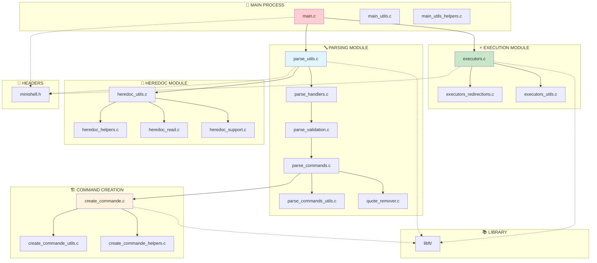
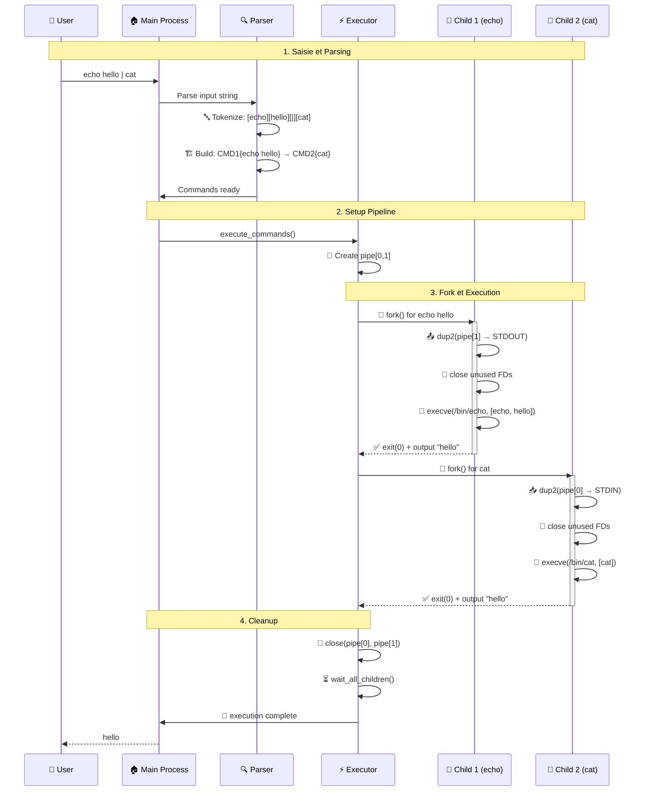
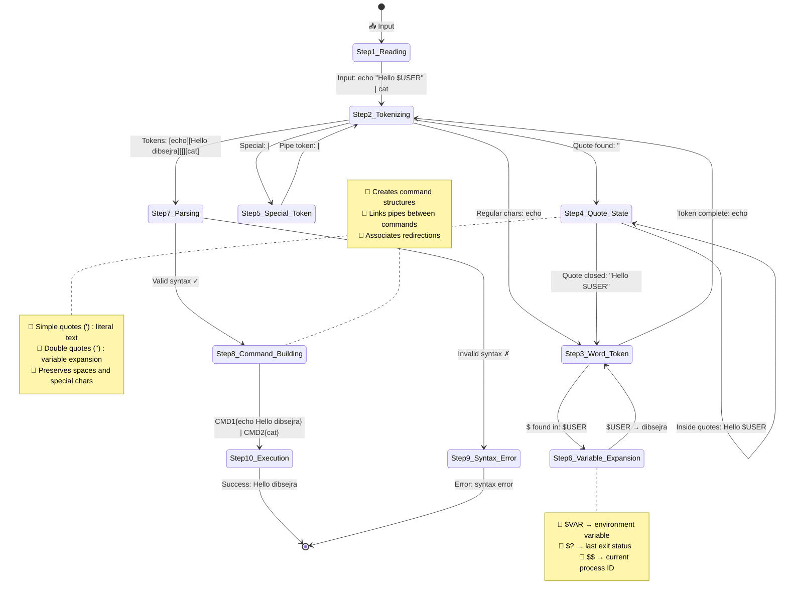
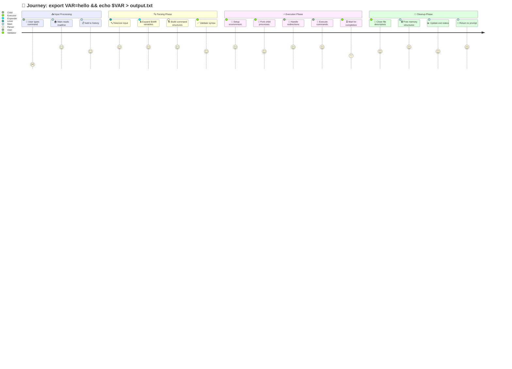
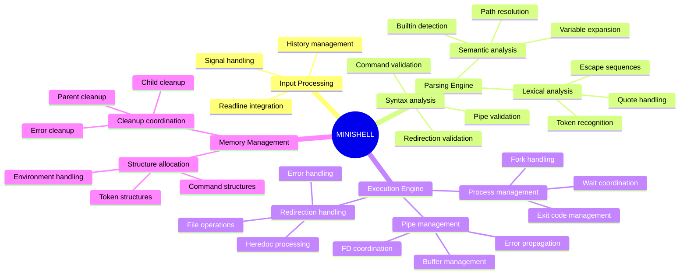
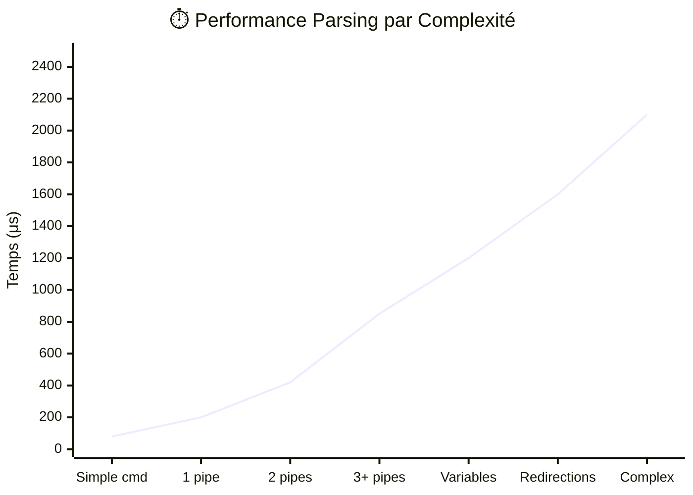
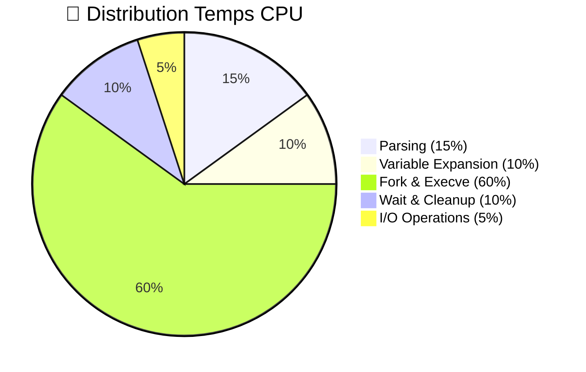

# 📊 Diagrammes Architecture - Minishell

## 🎯 Vue d'ensemble du flux principal

### Exemple : `echo $HOME | cat`

```mermaid
flowchart TD
    A[📥 Input: echo $HOME | cat] --> B[🔤 Lexer/Tokenizer]
    B --> C[📋 Token Stream]
    C --> D[💲 Expander]
    D --> E[✨ Expanded Tokens]
    E --> F[🔍 Parser]
    F --> G[🏗️ Command Structure]
    G --> H[⚡ Executor]
    H --> I[📤 Output: /Users/dibsejra]
    
    B --> B1[WORD: echo]
    B --> B2[VAR: $HOME]
    B --> B3[PIPE: |]
    B --> B4[WORD: cat]
    
    D --> D1[WORD: echo]
    D --> D2[WORD: /Users/dibsejra]
    D --> D3[PIPE: |]
    D --> D4[WORD: cat]
    
    F --> F1[CMD1: echo /Users/dibsejra]
    F --> F2[CMD2: cat]
    
    H --> H1[fork + pipe + execve]
    H --> H2[wait + cleanup]
    
    style A fill:#e1f5fe
    style I fill:#c8e6c9
    style H fill:#fff3e0
    style B fill:#f3e5f5
    style D fill:#fff8e1
    style F fill:#e8f5e8
```

### Étapes du flux :
1. **📥 Input** : Réception commande utilisateur
2. **🔤 Tokenizing** : Découpage [echo][$HOME][|][cat]
3. **💲 Expansion** : $HOME → /Users/dibsejra
4. **🔍 Parsing** : Construction structure commandes
5. **⚡ Execution** : Fork, pipe, execve, wait

## 🏗️ Architecture modulaire détaillée



## 🔄 Pipeline d'exécution des commandes

### Exemple : `echo hello | cat`



### Séquence numérotée :
1. **👤 User Input** : Saisie commande
2. **🔍 Parsing** : Analyse et tokenisation
3. **🔗 Pipe Setup** : Création pipeline
4. **🍴 Fork Child 1** : Processus echo
5. **📤 Redirect Output** : STDOUT vers pipe
6. **🚀 Execve Echo** : Exécution echo hello
7. **🍴 Fork Child 2** : Processus cat
8. **📥 Redirect Input** : STDIN depuis pipe
9. **🚀 Execve Cat** : Exécution cat
10. **🏁 Wait & Cleanup** : Synchronisation et nettoyage

## 🧠 Gestion mémoire et structures de données

### Exemple : `ls -la | grep txt`

```mermaid
graph TD
    subgraph "📋 PARSING FLOW"
        IN[🎯 Input: ls -la | grep txt] --> TOK[📋 Token List]
        TOK --> CMD[🏗️ Command List]
    end
    
    subgraph "🔗 TOKEN STRUCTURE"
        TOK --> T1[t_token 1: ls]
        T1 --> T2[t_token 2: -la] 
        T2 --> T3[t_token 3: |]
        T3 --> T4[t_token 4: grep]
        T4 --> T5[t_token 5: txt]
        T5 --> TNULL[NULL]
    end
    
    subgraph "🏗️ COMMAND STRUCTURE"
        CMD --> C1[t_cmd 1: ls -la]
        C1 --> C2[t_cmd 2: grep txt]
        C2 --> CNULL[NULL]
        
        C1 --> A1[args: [ls, -la, NULL]]
        C1 --> F1[files: NULL]
        C2 --> A2[args: [grep, txt, NULL]]
        C2 --> F2[files: NULL]
    end
    
    subgraph "♻️ CLEANUP HIERARCHY"
        FREE3[🗑️ free_minishell] --> FREE2[🗑️ free_commands]
        FREE3 --> FREE1[🗑️ free_tokens]
        FREE2 --> FREE4[🗑️ free_files]
        FREE2 --> FREE5[🗑️ free_args]
    end
    
    T1 -.->|malloc/free| FREE1
    C1 -.->|malloc/free| FREE2
    
    style IN fill:#e3f2fd
    style FREE1 fill:#ffebee
    style FREE2 fill:#ffebee
    style FREE3 fill:#ffebee
    style T1 fill:#fff3e0
    style C1 fill:#e8f5e8
```

### Structure mémoire :
1. **🎯 Input String** : Ligne utilisateur brute
2. **📋 Token Linked List** : Chaîne de t_token
3. **🏗️ Command Linked List** : Chaîne de t_cmd
4. **📝 Args Arrays** : Tableaux arguments par commande
5. **📁 Files Lists** : Listes redirections par commande
6. **🗑️ Cleanup Cascade** : Libération hiérarchique

## 🔧 Processus de parsing détaillé

### Exemple concret : `echo "Hello $USER" | cat`



### Ordre de traitement numéroté :

1. **📥 Reading Input** : Réception ligne utilisateur
2. **🔤 Tokenizing** : Découpage en tokens
3. **📝 Word Token** : Traitement mots normaux
4. **"" Quote State** : Gestion quotes et contenu
5. **⚡ Special Token** : Opérateurs (|, <, >, <<, >>)
6. **💲 Variable Expansion** : Remplacement variables
7. **🔍 Parsing** : Validation syntaxique
8. **🏗️ Command Building** : Construction structures
9. **❌ Syntax Error** : Gestion erreurs
10. **⚡ Execution** : Lancement commandes

## 🚀 Architecture des processus et pipes

### Exemple : `ls | grep txt | head -3`

```mermaid
graph LR
    subgraph "🏠 MAIN PROCESS"
        M[🎯 Main Shell<br/>PID: 1234]
        P[🔍 Parser<br/>Module]
        E[⚡ Executor<br/>Manager]
    end
    
    subgraph "🔀 CHILD PROCESSES"
        C1[👶 Child 1<br/>ls<br/>PID: 1235]
        C2[👶 Child 2<br/>grep txt<br/>PID: 1236]
        C3[👶 Child 3<br/>head -3<br/>PID: 1237]
    end
    
    subgraph "🔗 PIPE NETWORK"
        P1[📡 pipe1[0,1]<br/>ls → grep]
        P2[📡 pipe2[0,1]<br/>grep → head]
    end
    
    M -->|1. Parse| P
    P -->|2. Execute| E
    
    E -->|3. Fork| C1
    E -->|4. Fork| C2
    E -->|5. Fork| C3
    
    C1 -->|6. STDOUT| P1
    P1 -->|7. STDIN| C2
    
    C2 -->|8. STDOUT| P2
    P2 -->|9. STDIN| C3
    
    C3 -->|10. Output| U[👤 User Terminal]
    
    E -.->|wait()| C1
    E -.->|wait()| C2
    E -.->|wait()| C3
    
    style M fill:#e1f5fe
    style C1 fill:#c8e6c9
    style C2 fill:#c8e6c9
    style C3 fill:#c8e6c9
    style P1 fill:#fff3e0
    style P2 fill:#fff3e0
    style U fill:#ffe0e0
```

### Flux des processus :
1. **🎯 Main** : Parse commande complexe
2. **🔍 Parser** : Identifie 3 commandes + 2 pipes
3. **⚡ Executor** : Setup pipes et forks
4. **👶 Fork ls** : Processus enfant pour ls
5. **👶 Fork grep** : Processus enfant pour grep txt
6. **👶 Fork head** : Processus enfant pour head -3
7. **📡 Pipe1** : ls STDOUT → grep STDIN
8. **📡 Pipe2** : grep STDOUT → head STDIN
9. **⏳ Wait** : Synchronisation des 3 processus
10. **👤 Output** : Résultat final à l'utilisateur

## 📊 Cycle de vie d'une commande

### Journey : `export VAR=hello && echo $VAR > output.txt`



### Phases détaillées :
1. **📥 Input** : Readline, historique, signaux
2. **🔍 Parsing** : Tokens → AST → Commands
3. **⚡ Execution** : Fork, pipes, redirections, execve
4. **🏁 Cleanup** : Memory, FDs, status, prompt

## 🎯 Diagramme des responsabilités



## 🔍 Diagramme de classes (structures C)

```mermaid
classDiagram
    class t_minishell {
        +t_env *env
        +t_cmd *commands
        +char **envp
        +int exit_code
        +int in_heredoc
    }
    
    class t_cmd {
        +char **args
        +char *path
        +t_file *files
        +t_cmd *next
        +int builtin_type
    }
    
    class t_token {
        +char *value
        +t_token_type type
        +t_token *next
        +int quoted
    }
    
    class t_file {
        +char *filename
        +t_file_type type
        +t_file *next
        +int fd
    }
    
    class t_env {
        +char *key
        +char *value
        +t_env *next
        +int exported
    }
    
    class t_process_data {
        +t_minishell *shell
        +t_shell_ctx *ctx
        +char *input
        +int flags
    }
    
    t_minishell ||--o{ t_cmd : contains
    t_minishell ||--o{ t_env : manages
    t_cmd ||--o{ t_file : has
    t_token ||--o| t_token : next
    t_cmd ||--o| t_cmd : next
    t_file ||--o| t_file : next
    t_env ||--o| t_env : next
    
    t_process_data ||--|| t_minishell : uses
```

## 📈 Métriques et performance

### Performance par complexité de commande



### Répartition temps d'exécution



### Métriques détaillées :
1. **Simple cmd** : `ls` → 80μs
2. **1 pipe** : `ls | cat` → 200μs
3. **2 pipes** : `ls | grep | head` → 420μs
4. **3+ pipes** : Pipeline complexe → 850μs+
5. **Variables** : `echo $HOME $USER` → 1200μs
6. **Redirections** : `cmd > file < input` → 1600μs
7. **Complex** : Combinaison tout → 2100μs+

Ces diagrammes Mermaid peuvent être intégrés directement dans la documentation GitHub ou visualisés sur des plateformes supportant Mermaid comme GitLab, Notion, ou des éditeurs comme VS Code avec l'extension Mermaid.